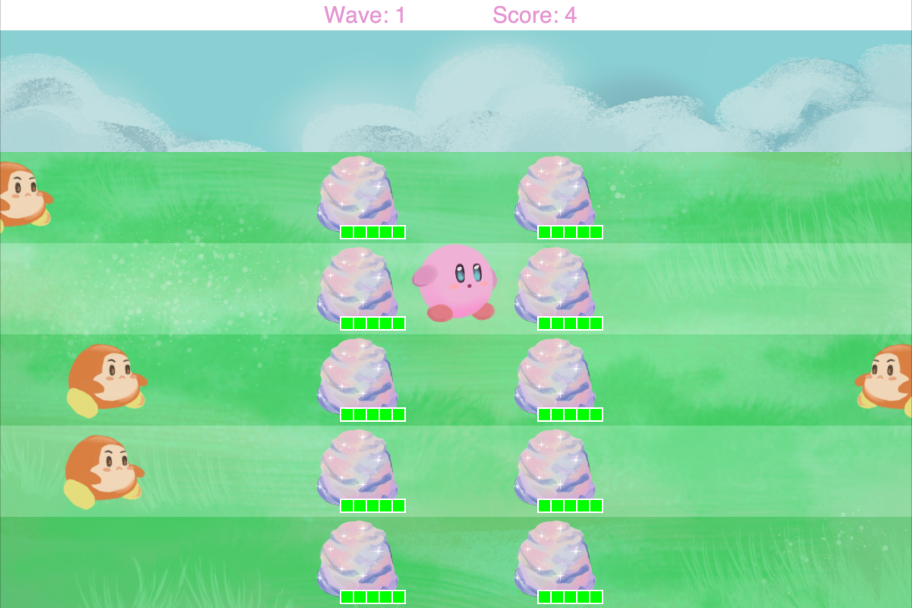
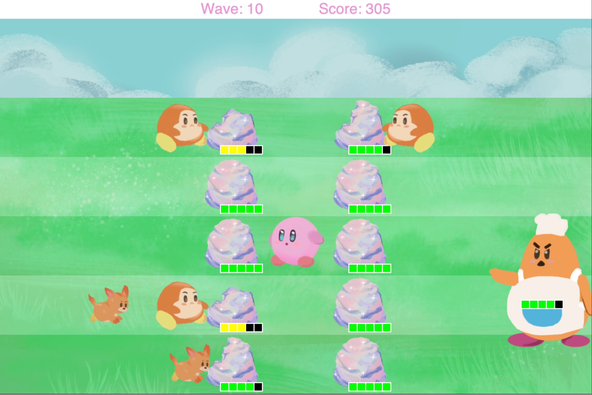
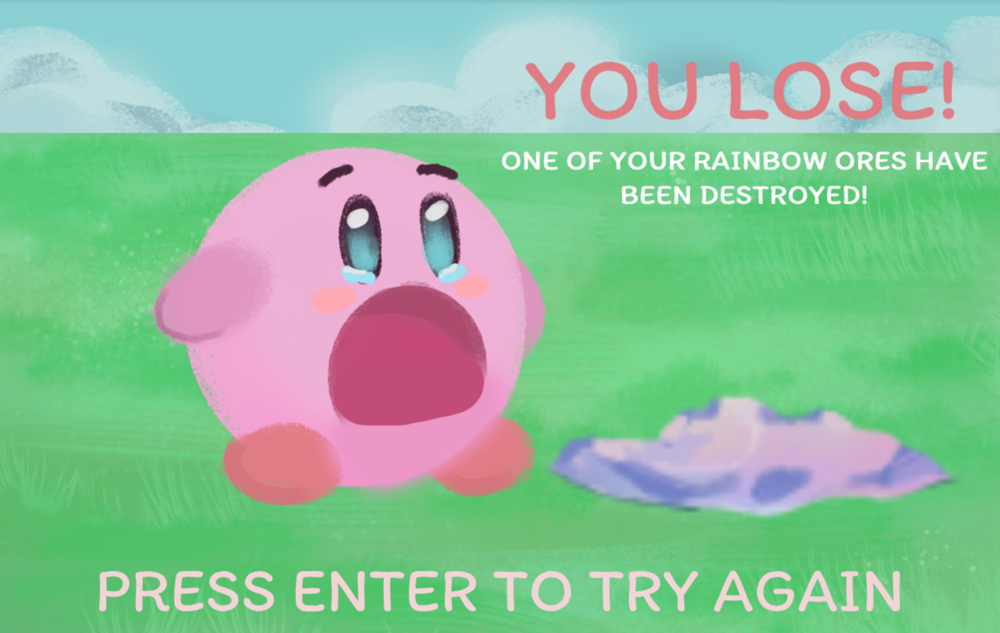

# Kirby Star Defense
Kirby Shooter Game \
Completed 2022 \
By **Clara Hong** (clarashong)

## Description

This fun shooter game project stars the beloved character Kirby by Masahiro Sakurai. 
The player fights Kirby-universe enemies in an effort to protect their precious ores. The game was practice and an opportunity to learn Greenfoot, 
object oriented programming, and game design. 
Kirby and its universe's characters belong to Nintendo and HAL's Labratory, I do not take any credit for character designs. 
I simply wanted to make a shooter game involving such beloved characters. 

## Installation

In order for the game to be able to choose the solution word, users must have Greenfoot installed. 
Greenfoot can be installed at:
[https://www.greenfoot.org/download](https://www.greenfoot.org/download) 
\
Once installed, open Greenfoot, click Scenario >> open >> choose folder: HongClaraKirbyStarDefense

To play the game, click Run. 

## GamePlay 
Shoot the enemies with your stars: 
\
 
\
Survive each wave and watch out for the Big Boss!: 
\

\
If your ores run out of health: \

## License
Kirby and its universe's characters belong to Nintendo and HAL's Labratory

## Image and Sound Credits: 
Image and sound credits can be found in GameFiles >> HongClaraKirbyStarDefense >> "GameWorld.java" 

## How to Contribute

Not accepting contributions. 

